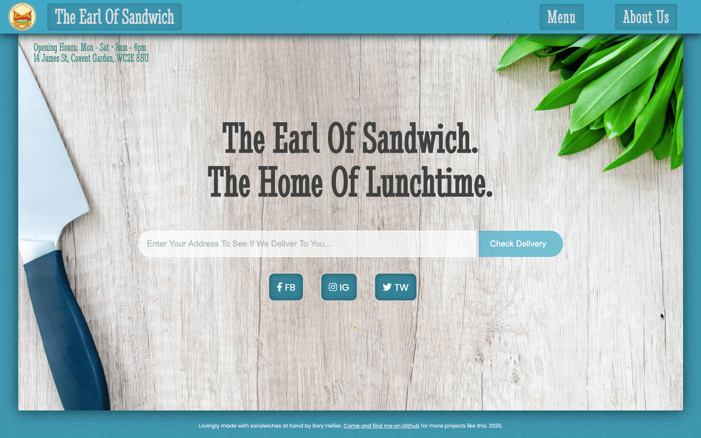

  

  <h1 align="center">🥪 Restaurant Website</h1>

<h3 align='center'>  
    A Simple, Easy To Navigate Restaurant Website.
</h3>

     
    <a href="https://the-earl-of-sandwich.netlify.app/"><strong>Visit The Site »</strong></a>
     
     
    <a href="https://github.com/Rhelli/Restaurant-Website/archive/develop.zip">Download this repository</a>
    |
    <a href="https://github.com/Rhelli/Restaurant-Website/issues/new/choose">Report A Bug</a>
    |
    <a href="https://github.com/Rhelli/Restaurant-Website/fork">Fork It</a>
  

## Table of Contents
  - [The Project Brief](https://github.com/Rhelli/Restaurant-Website/tree/feature/readme#-the-project-brief)
  - [The Nitty Gritty](https://github.com/Rhelli/Restaurant-Website/tree/feature/readme#-the-nitty-gritty)
  - [Tools & Technology Used](https://github.com/Rhelli/Restaurant-Website/tree/feature/readme#-tools--technology-used)
  - [Setup & Use](https://github.com/Rhelli/Restaurant-Website/tree/feature/readme#%EF%B8%8F-setup--use)
  - [Showcase](https://github.com/Rhelli/Restaurant-Website/tree/feature/readme#-showcase)
  - [Contributions, Issues and Forking](https://github.com/Rhelli/Restaurant-Website/tree/feature/readme#-contributions-issues-and-forking)
  - [Creator](https://github.com/Rhelli/Restaurant-Website/tree/feature/readme#%EF%B8%8F-creator)
  - [Show Your Support!](https://github.com/Rhelli/Restaurant-Website/tree/feature/readme#%EF%B8%8F-show-your-support)
  - [Licensing](https://github.com/Rhelli/Restaurant-Website/tree/feature/readme#-licensing)

## 💡 The Project Brief

This is a project to be included by all students at [Microverse](https://www.microverse.org/) as part of the Javascript module.

In this project, we are tasked with building a restaurant website with Javascript and Webpack. Having covered the basics of working with npm and webpack, this is an excellent opportunity to get to grips, firstly with using Javascript for DOM manipulation and secondly, Webpack, in order to manage our projects. The aim here, therefore, is to dynamically generate our restaurants website with Javscript alone (and a little styling, of course).

## 🧠 The Nitty Gritty
The core challenges here was in ensuring our projects were handled in a modular way. This meant ensuring that each 'tab' or 'page' of our restaurant had its own separate script in order maintain a clean and maintainable code base.

Additionally, we would be using Javascript to build the entire site dynamically. Generating countless HTML elements such as divs and the elements that sit inside them proved labourous, so I chose to create a generator script to provide essential functions:
  - htmlGenerate: Creates an html tag with a class and an (optional) id attached
  - textGen: Creates a hmtl text element
  - spaceParse: Takes a symbol and a string with spaces replaced by the given symbol to present a beautified string

Without these tools, build time for basic HTML structure would have been far longer. An additional challenge of this project was in using Webpack effectively in order to package our code and assets. Correct configuration and use of the correct loaders and plugins was required.

## 🧰 Tools & Technology Used
**Languages & Frameworks**
 - Javascript
 - Webpack 4.44
 - SASS/CSS3

**Package Management**
 - NPM

**Linters & Quality Control**
 - [ESlint](https://eslint.org/)
 - [StyleLint](https://stylelint.io/)

### 🛠️ Setup & Use

#### Setup
For the live site, [head here.](https://the-earl-of-sandwich.netlify.app/)

1. To inspect and tinker with the code on your system, download this repo either [here](https://github.com/Rhelli/Restaurant-Website/archive/develop.zip) or from the link at the top of the page

2. Now it's time to ensure you've got Node and NPM installed. If you do, skip this step. Otherwise, head on over to [nodejs's website](https://nodejs.org/en/) to download node with npm.

3. Time to go back to the project! Open your terminal (either in your text editor or otherwise) and 'cd' (i.e. navigate) to the root of this repo.

4. Time to install Webpack! Ensuring you're at this repo's root, enter the following command into your terminal. This will install webpack locally (to this project only):
    
        `npm install --save-dev webpack`

5. Finally, once webpack has installed successfully, run the following command to install all of the projects dependencies:

        `npm install`

#### Usage
There are a few commands that you can use interact with the project:
 - `$npm run build` - This will build the project using webpack and bundle everything into the `/dist` folder.
 - `$npm run watch` - This will build and update the project in the `/dist` folder **actively**, meaning changes will update `/dist`. You will, however, have to refresh the browser to see changes.
 - `$npm run start` - This will build and update the project with changes. No browser refresh required.

******

## 🍿 Showcase

### A Quick Site Tour

> A quick tour around the site, with a preview of the sites page transitions.

### The Menu Page and Scroll Links

> A preview of the menu page with its quick scroll links for easy navigation.

### Viewing Friend Requests From The Navbar

> A quick look at the search bar. Entering an address to check for delivery will prompt the use with a call to action.

*******

## 🧬 Contributions, Issues and Forking

Contributions, issues and feature requests are more than welcome! 

If you have any problems running or setting up this project, please submit it as a bug on the [issues page](https://github.com/Rhelli/Restaurant-Website/issues) right away!

If you want to make your own changes, modifications or improvements, go ahead and Fork it!
1. [Fork it](https://github.com/Rhelli/Restaurant-Website/fork)
2. Create your working branch (git checkout -b [choose-a-name])
3. Commit your changes (git commit -am 'what this commit will fix/add/improve')
4. Push to the branch (git push origin [chosen-name])
5. Create a new Pull Request

## 🏋🏽‍♂️ Creator

Rory Hellier - [Github](https://github.com/Rhelli)

## 🙋🏽‍♂️ Show Your Support!
Give a ⭐️ if you like this project!

## 📑 Licensing
This project is [MIT](https://github.com/Rhelli/Restaurant-Website/LICENSE.txt) licensed.
